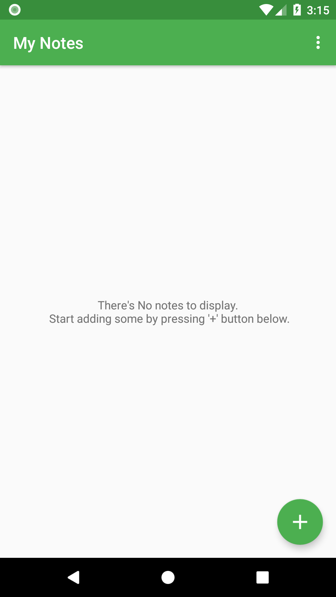
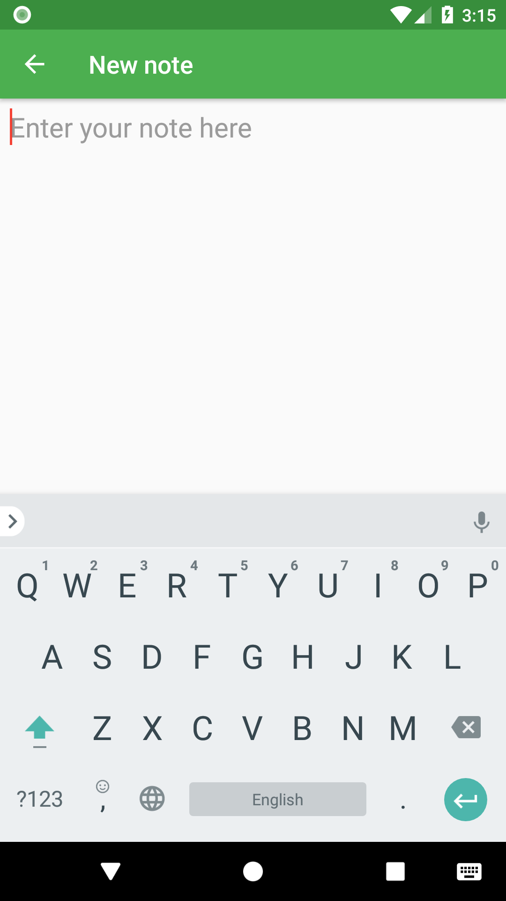
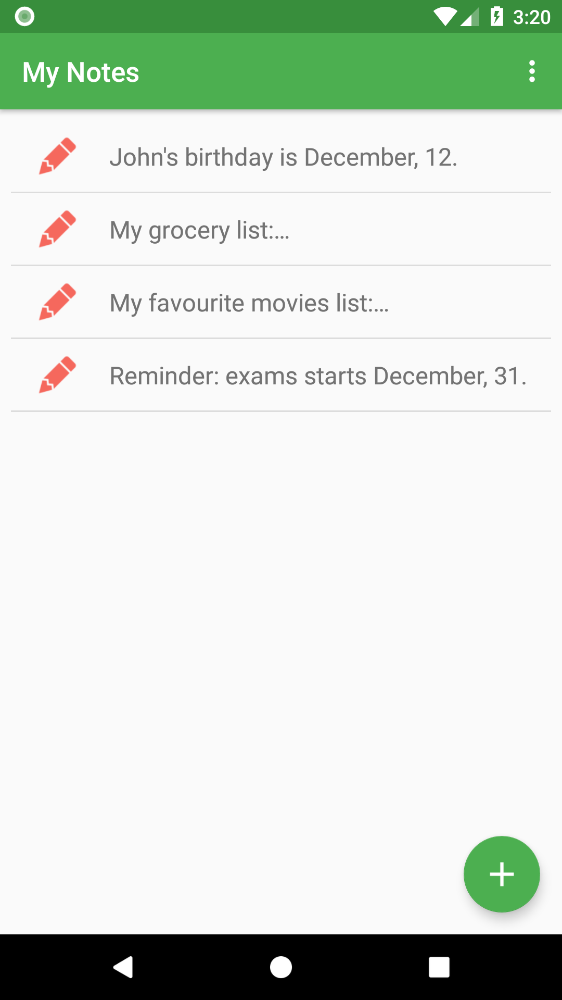
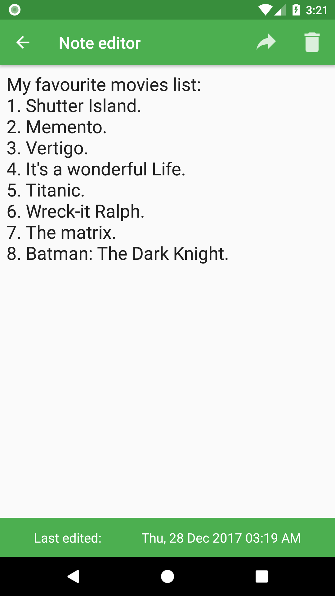
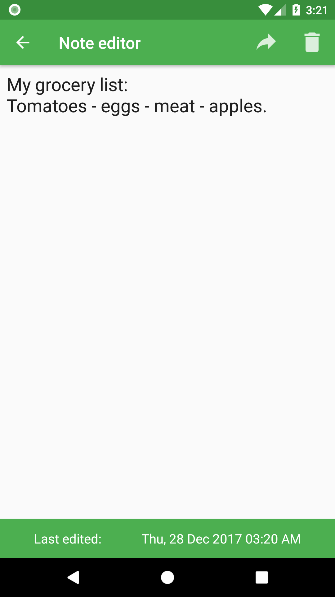
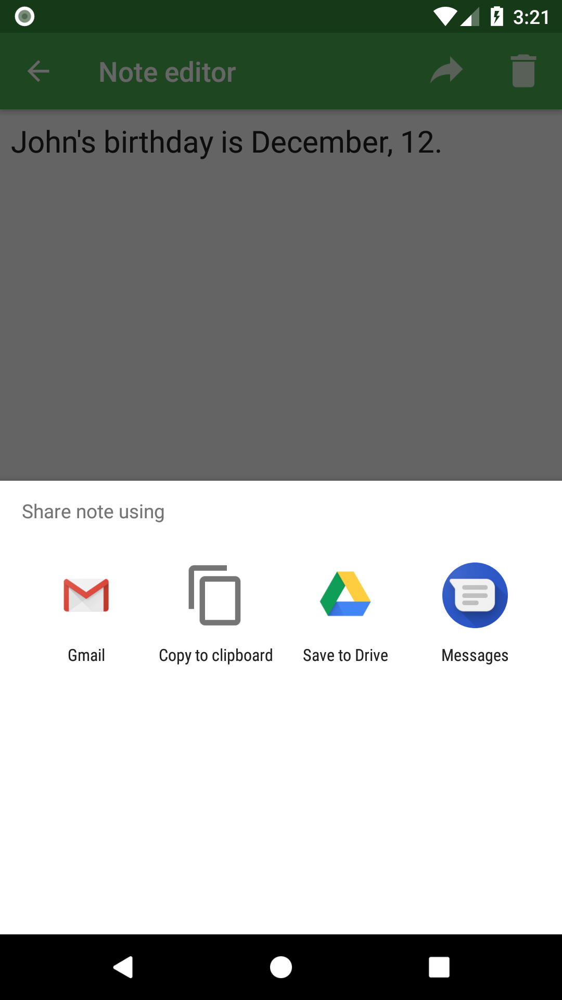
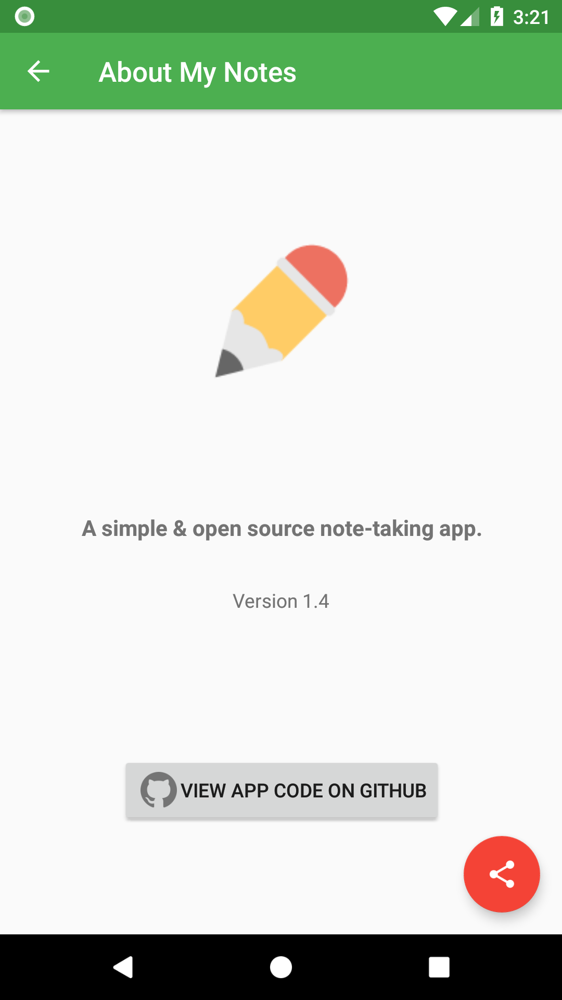

# My Notes - Toma notas en cualquier lugar

  
My Notes te permite tomar notas de texto en tu teléfono Android. Puedes tomar y consultar tus notas en cualquier momento y lugar; la aplicación funciona completamente sin conexión.

La aplicación está disponible en Google Play Store [aquí](https://play.google.com/store/apps/details?id=com.aa.mynotes), en F-Droid [aquí](https://f-droid.org/packages/com.aa.mynotes/) y también en Amazon Appstore [aquí](http://a.co/dSgDfIh).

## Capturas de pantalla
      

## Licencia
Este proyecto está licenciado bajo la licencia [GPLv3](https://github.com/Abdallah-Abdelazim/mynotes-app/blob/master/LICENSE).
